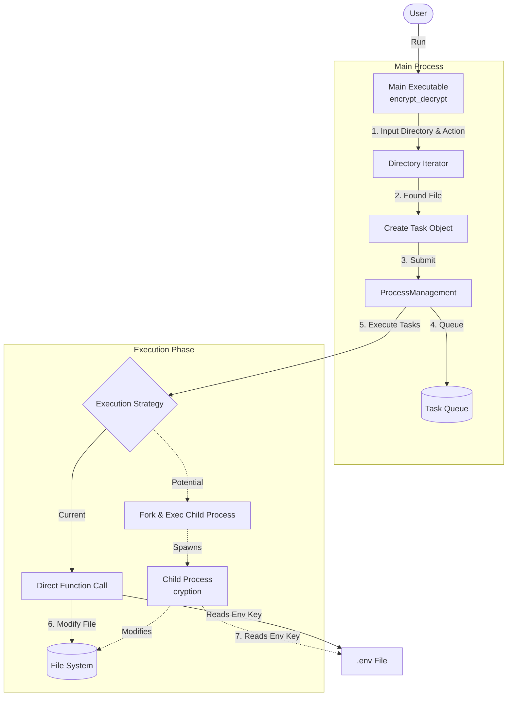

# Encrypty: Parallel Encryption & Decryption Tool

**Encrypty** is a C++ based tool designed to perform bulk encryption and decryption of files within a directory. It demonstrates a modular architecture capable of handling file processing tasks, with a foundation built for future parallel processing enhancements.

## 🚀 Overview

The project scans a specified directory recursively, identifies regular files, and creates "Tasks" for either encryption or decryption. These tasks are managed by a process manager which executes them.

The core encryption logic uses a simple byte-shift algorithm based on a key stored in a `.env` file.

> [!NOTE]
> This codebase currently runs tasks sequentially for simplicity and debugging, but contains the infrastructure (`fork()`, `execv`) to easily switch to a multi-process architecture for parallel execution.

## 🏗️ Architecture

The system is compiled into two main executables:
1. **`encrypt_decrypt`**: The main entry point that discovers files and orchestrates the work.
2. **`cryption`**: A standalone executable designed to handle a single file task (used in the multi-process model).

### System Component Diagram



### Key Components

| Component | Description |
|-----------|-------------|
| **`ProcessManagement`** | Manages the queue of tasks and handles their execution. It abstracts the execution strategy (sequential vs parallel). |
| **`Task`** | Represents a unit of work (a specific file and an action). Can serialize itself to a string for passing to child processes. |
| **`IO`** | Handles file stream operations (opening/closing). |
| **`ReadEnv`** | Reads the encryption key from the `.env` file. |
| **`Cryption`** | Contains the core logic to shift bytes in the file based on the key. |

## 🛠️ Setup & Installation

### Prerequisites
- C++ Compiler (supporting C++17)
- GNU Make

### Build Steps

1. **Clone the repository**
   ```bash
   git clone <repo-url>
   cd encrypty
   ```

2. **Create the Environment File**
   Create a `.env` file in the root directory containing your integer key (e.g., `8717`).
   ```bash
   echo "8717" > .env
   ```

3. **Compile**
   Use the provided Makefile to build the project.
   ```bash
   make
   ```
   This will create `encrypt_decrypt` and `cryption` executables.

## 💻 Usage

1. **Prepare a Test Directory**
   Create a directory with some text files to test the encryption.
   ```bash
   mkdir test_data
   echo "Hello World" > test_data/file1.txt
   echo "Secret Data" > test_data/file2.txt
   ```

2. **Run the Tool**
   ```bash
   ./encrypt_decrypt
   ```

3. **Follow Prompts**
   - **Directory path**: Enter the path to your folder (e.g., `test_data`).
   - **Action**: Enter `encrypt` or `decrypt`.

   **Example Session:**
   ```text
   Enter the directory path: test_data
   Enter the action (encrypt/decrypt): encrypt
   Executing task: test_data/file1.txt,ENCRYPT
   Executing task: test_data/file2.txt,ENCRYPT
   ```

4. **Verify**
   Check the content of your files. They should now be encrypted (jumbled). Run the tool again with `decrypt` to restore them.

## 📂 Project Structure

```
.
├── Makefile                # Build configuration
├── README.md               # Documentation
├── main.cpp                # Main entry point
├── .env                    # Encryption key (not tracked by git usually)
└── src
    └── app
        ├── encryptDecrypt  # Core logic for encryption/decryption
        ├── fileHandling    # File IO and Env reading
        └── processes       # Task and Process management
```
